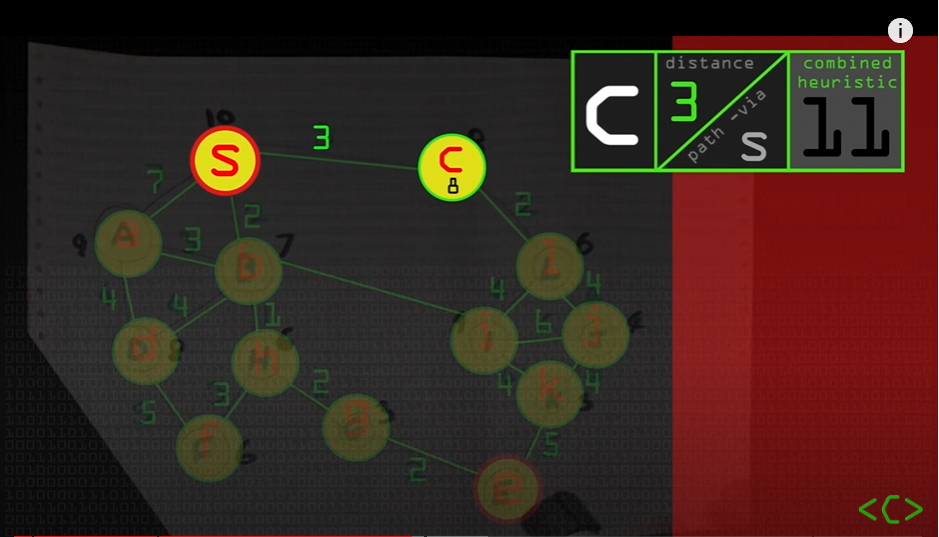
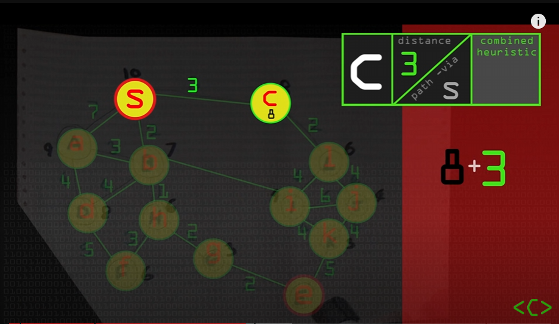

How does A Star Work: 

Chooses the shorest path by taking in the lenght and weight of the paths , an optimized version of  Dijkstra's Algorithm

Bard youtube synopsis of a-star video:
Here is a summary of the video:

The video reviews the A* (A Star) search algorithm, which is a graph search algorithm that finds the shortest path between two nodes in a graph. The algorithm works by using a heuristic function to estimate the distance to the goal node, and then using this information to prioritize which nodes to explore next. The video also discusses how the A* algorithm can be used to find the shortest path between two points on a map.

The video starts by reviewing the Dijkstra algorithm, which is a similar graph search algorithm that does not use a heuristic function. The video then explains how the A* algorithm works, and how it can be used to find the shortest path between two nodes in a graph. The video also discusses how the A* algorithm can be used to find the shortest path between two points on a map.

Finally, the video discusses some of the limitations of the A* algorithm, and how it can be improved. The video also discusses some of the applications of the A* algorithm, such as in robotics and pathfinding. 

**I. Introduction**

**A. Problem Statement**

1. The goal is to find the shortest path between two points.
2. This problem is common in computer science and has many applications.

**B. Graph Representation**

1. A graph is a data structure used to represent relationships between entities.
2. Nodes represent entities, and edges represent relationships between entities.
3. Each edge has a weight, which represents the cost of traversing the edge.

**C. Dijkstra's Algorithm**

1. Dijkstra's algorithm is a popular algorithm for finding the shortest path between two points.
2. It works by keeping track of the shortest path to each node in the graph.
3. It is guaranteed to find the shortest path between two points.

**D. A* Algorithm**

1. A* is an extension of Dijkstra's algorithm that uses a heuristic to improve its performance.
2. A heuristic is a function that estimates the distance to the goal node.
3. A* is guaranteed to find the shortest path between two points if the heuristic is admissible.

**E. Applications**

1. A* is often used in applications where it is important to find the shortest path quickly, such as in route planning.
2. It is also used in other applications, such as robotics and pathfinding.

